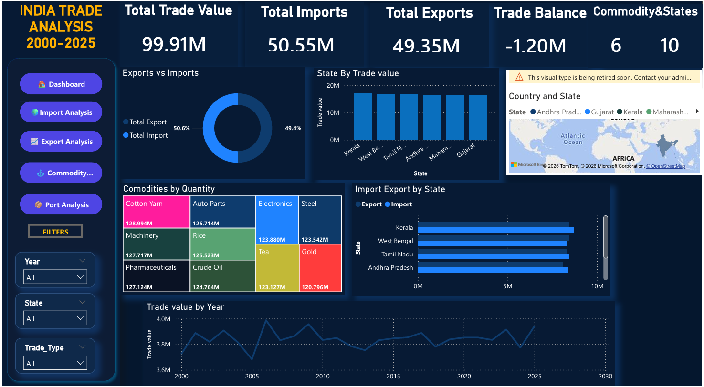
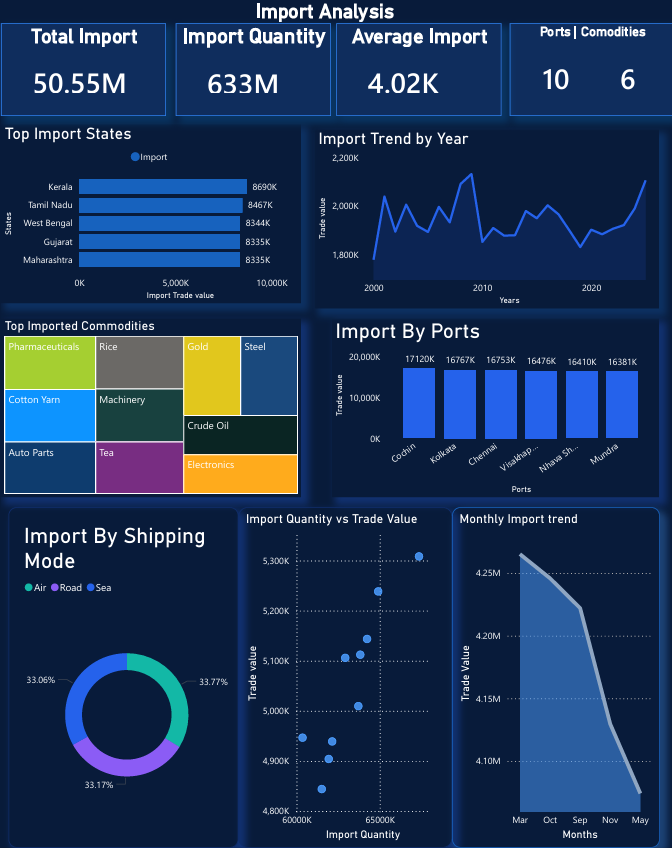
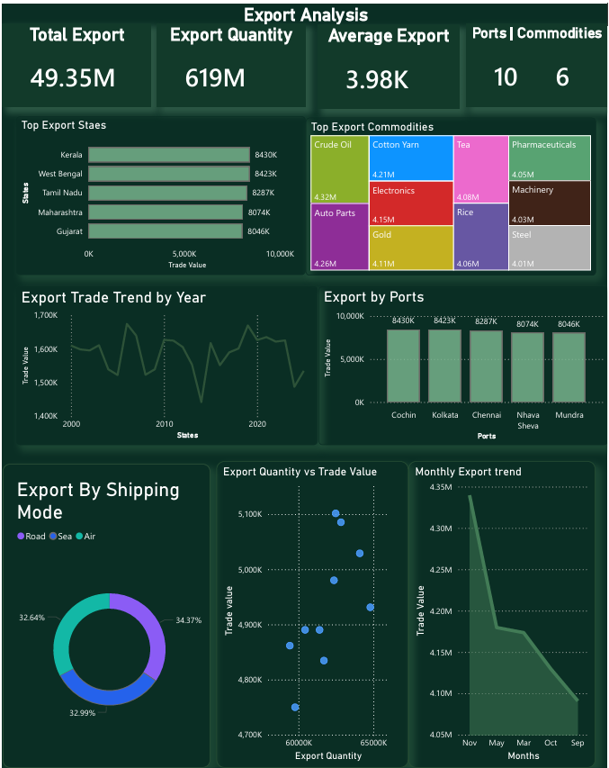
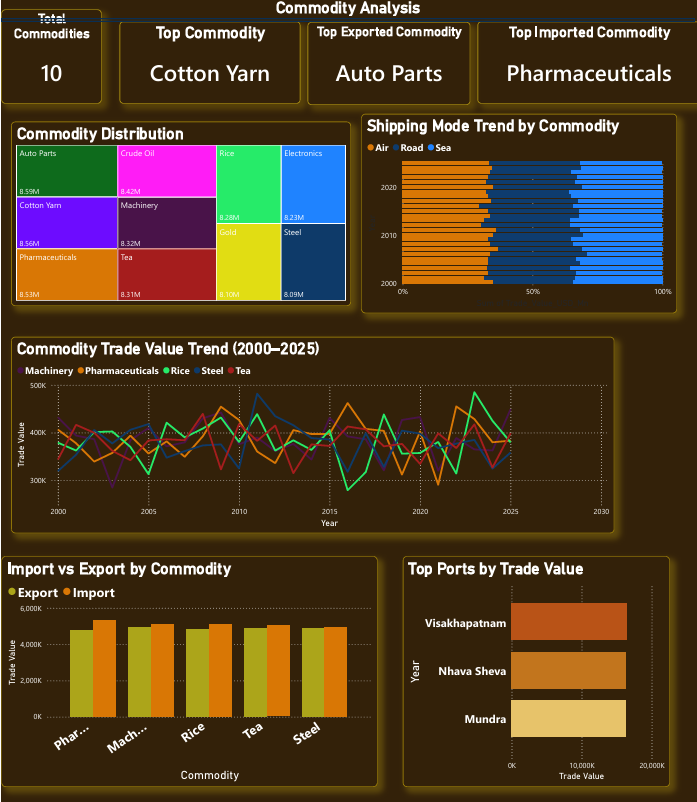
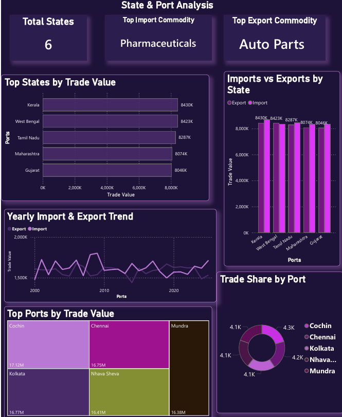

# 🇮🇳 India Trade Analysis Dashboard – Power BI

##  Project Overview

An interactive Power BI dashboard designed to analyze India's trade
performance from 2000 to 2025.

The dashboard provides insights into imports, exports, trade balance,
commodities, states, and yearly trade trends.

## 🛠️ Tools & Technologies

- Microsoft Power BI
- Power Query
- DAX
- Data Cleaning & Transformation
- Data Visualization

## 📈 Dashboard Features

- Total Trade Value
- Total Imports
- Total Exports
- Trade Balance
- Import vs Export Analysis
- State-wise Trade Analysis
- Commodity-wise Analysis
- Year-wise Trade Trends
- Interactive filters for Year, State and Trade Type

## 🔍 Key Analysis

The dashboard helps analyze:

- India's import and export performance
- State-wise trade values
- Commodity-wise trade quantities
- Trade trends from 2000–2025
- Import vs export comparison
- Trade balance

## 📂 Project File

`trade_analysis-2005.pbix` – Power BI dashboard file.

## 📷 Dashboard Preview

### Dashboard

### Import Analysis

### Export Analysis

### Commodity Analysis

### Port Analysis

## 👩‍💻 Author

**Trupti Rajendra Garud**

Aspiring Data Analyst | Power BI | SQL | Excel | Python
